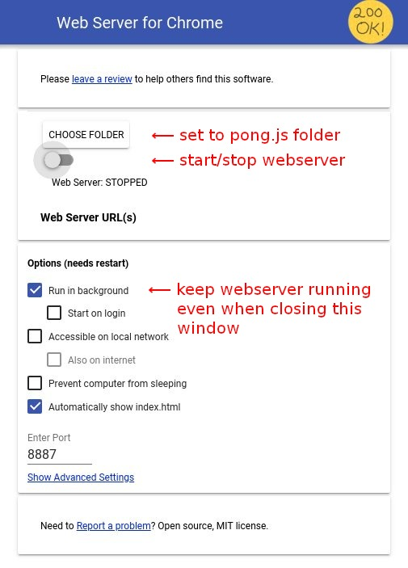

# Installing a basic web server

Here are some instructions for installing a basic web server inside Chrome for local HTML5 development.

For those who prefer watching instruction videos on YouTube, please watch [this video](https://www.youtube.com/watch?v=fSB8L4-QoWk)

Assuming that you have already downloaded pong.js to a local folder, there are only three simple steps:

1. Install the [Webserver for Chrome](https://chrome.google.com/webstore/detail/web-server-for-chrome/ofhbbkphhbklhfoeikjpcbhemlocgigb) app from the Chrome Web Store.
2. Navigate to [chrome://apps](chrome://apps) and start the _Web Server_ app.
3. Configure the app by clicking on _Choose folder_ and select the _pong.js_ folder. (See figure 1.)

Once installed and started, navigate to [http://localhost:8887/pong.html](http://localhost:8887/pong.html).

_Figure 1 - Web Server for Chrome Settings_
